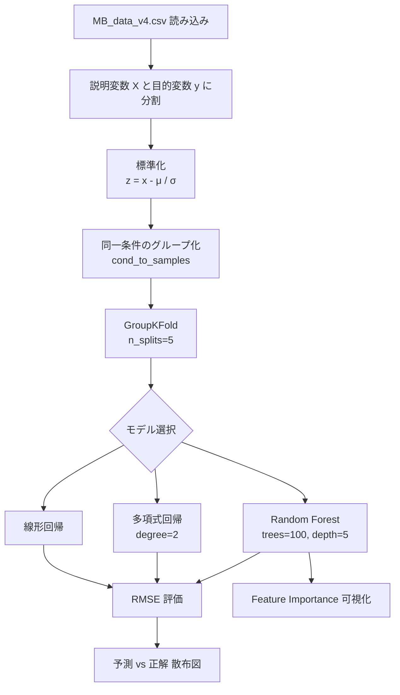

# ファインバブル発生装置の最適操作条件検討 — 分析レポート

`orders/order_001.md` に基づき，本実験（`ex001_base_model`）における研究目的，データセット，およびプログラムの分析結果をまとめたものである．

---

## 1. 研究目的

### 1.1 背景

ファインバブル（Fine Bubble, FB）は直径 $100\,\mu\mathrm{m}$ 以下の微細気泡であり，サイズ効果に由来する高い滞留性およびガス溶解性を有する．酸素供給や環境改善技術など，幅広い分野での社会実装が進められている．気泡内部に酸素やオゾンなどのガスを封入することで，機能性や化学的特性を付与できることが知られている．

### 1.2 目的

FB の生成条件と酸素含量およびバブル濃度との関係は，十分に解明されていない．本研究では，機械学習を用いて生成条件と FB 特性との関係を解析し，以下を達成することを目的とする．

- 酸素含量ならびに UFB・MB 濃度の向上に寄与する主要因子の抽出
- 最適生成条件の探索
- 各目的変数に応じた予測モデルの構築

### 1.3 実験装置と測定

FBG-OS Type1 による FB 発生装置を用いてファインバブルを生成した．生成した FB について，以下の計測器により物性値を測定した．

| 測定項目 | 略称 | 計測器 |
| :--- | :--- | :--- |
| UFB 濃度 | NB conc. | NanoSight LM10 |
| MB 濃度 | MB conc. | PartAn SI |
| 酸素含量 | Oxygen cont. | Oxygraph |

---

## 2. データセット分析

### 2.1 概要

本実験で使用するデータセットは `MB_data_v4.csv` である．

| 項目 | 値 |
| :--- | :--- |
| サンプル数 | 82 |
| 変数数 | 12（説明変数 6，目的変数 6） |
| ユニークな操作条件数 | 39 |
| 条件あたりの反復測定数 | 1〜5 |

### 2.2 説明変数（操作条件）

生成条件として，以下 6 変数を設定した．

| 変数名 | 記号 | 単位 | 設定値 |
| :--- | :--- | :--- | :--- |
| 溶解管長さ | $L_{\mathrm{diss}}$ | m | 0.12, 2.0 |
| 溶解圧力 | $P_{\mathrm{diss}}$ | MPa | 2, 3, 4 |
| 吐出管長さ | $L_{\mathrm{dis}}$ | m | 0.7, 2, 4, 5 |
| 酸素流量 | $Q_{\mathrm{O_2}}$ | mL/min | 3.3, 5, 10, 25 |
| 水流量 | $Q_{\mathrm{H_2O}}$ | mL/min | 25, 40, 45, 46.7 |
| 水量 | $V_{\mathrm{w}}$ | mL | 50, 100 |

### 2.3 目的変数（FB 物性値）

各操作条件で測定された FB 物性値は以下 6 変数である．

| 変数名 | 単位 | 平均 | 最小 | 最大 |
| :--- | :--- | ---: | ---: | ---: |
| Mean size | nm | 139.35 | 67.6 | 277.4 |
| Mode size | nm | 113.50 | 56.8 | 177.8 |
| NB concentration | $\times 10^7$ particles/mL | 4.90 | 0.64 | 16.69 |
| MB concentration | particles/mL | 309.41 | 51.19 | 933.27 |
| Size (bin) | $\mu\mathrm{m}$ | 96.06 | 76.09 | 107.16 |
| Oxygen content | mg/L | 48.48 | 35.02 | 60.71 |

### 2.4 データの特徴

#### 標準化前の変動係数（CV）

各目的変数の変動係数 $CV = \sigma / \mu$ は以下の通りである．

| 変数 | CV |
| :--- | ---: |
| Mean size | 0.216 |
| Mode size | 0.228 |
| NB concentration | 0.636 |
| MB concentration | 0.688 |
| Size (bin) | 0.068 |
| Oxygen content | 0.112 |

NB 濃度および MB 濃度は CV が大きく，操作条件による変動が顕著である．一方，Size (bin) は CV が小さく，測定値のばらつきが限定的である．

#### 条件内分散

同一操作条件における反復測定の平均標準偏差は以下の通りである．

| 変数 | 条件内平均 $\sigma$ |
| :--- | ---: |
| Mean size | 0.450 |
| Mode size | 0.458 |
| NB concentration | 0.349 |
| MB concentration | 0.167 |
| Size (bin) | 0.236 |
| Oxygen content | 0.289 |

MB 濃度は条件内分散が比較的小さく，再現性が高い傾向を示す．

---

## 3. プログラム分析

### 3.1 ファイル構成

```
ex001_base_model/
└── main.ipynb    # データ読み込み，前処理，モデル学習，評価，可視化
```

### 3.2 処理フロー



### 3.3 使用ライブラリ

| ライブラリ | 用途 |
| :--- | :--- |
| `numpy`, `pandas` | 数値計算，データ操作 |
| `matplotlib` | 可視化 |
| `sklearn.linear_model` | 線形回帰 |
| `sklearn.preprocessing.PolynomialFeatures` | 多項式特徴量生成 |
| `sklearn.ensemble.RandomForestRegressor` | Random Forest 回帰 |
| `sklearn.model_selection.GroupKFold` | グループ分割交差検証 |

### 3.4 前処理

1. **データ読み込み**: CSV の先頭 6 列を説明変数 $\mathbf{X}$，残り 6 列を目的変数 $\mathbf{y}$ として分割する．
2. **標準化**: 各変数について $z = (x - \mu) / \sigma$ により正規化する．評価指標 RMSE は標準化後のスケールで算出される．
3. **グループ分割**: 同一操作条件（6 変数が完全一致）のサンプルに同一グループ ID を付与し，`GroupKFold` により条件単位で train/test を分割する．これにより，同一条件のサンプルが train と test に同時に含まれるデータリークを防止する．

### 3.5 モデル構成

本プログラムでは，3 種類の回帰モデルを比較する．

#### 線形回帰

$$
\hat{y} = \mathbf{w}^\top \mathbf{x} + b
$$

ここで $\mathbf{x}$ は 6 次元の説明変数ベクトル，$\mathbf{w}$ は重み，$b$ はバイアスである．

#### 多項式回帰（次数 2）

`PolynomialFeatures(degree=2)` により，入力の 2 次項および交互作用項を含む特徴量を生成し，線形回帰を適用する．

#### Random Forest

| ハイパーパラメータ | 値 |
| :--- | :--- |
| `n_estimators` | 100 |
| `max_depth` | 5 |
| `random_state` | 0 |

過学習抑制のため木の深さを 5 に制限している．

### 3.6 評価指標

5-fold GroupKFold 交差検証における平均 RMSE を用いる．

$$
\mathrm{RMSE} = \sqrt{\frac{1}{N} \sum_{i=1}^{N} (\hat{y}_i - y_i)^2}
$$

ここで $\hat{y}_i$ は標準化後の予測値，$y_i$ は標準化後の正解値，$N$ はテストサンプル数である．

### 3.7 目的変数とインデックス対応

プログラム内では `teacher_signals` の列インデックスで目的変数を指定する．

| インデックス | 変数名 | 予稿での名称 |
| :---: | :--- | :--- |
| 2 | NB concentration | NB conc. (UFB 濃度) |
| 3 | MB concentration | MB conc. |
| 5 | Oxygen content | Oxygen cont. |

予稿（`proceeding.pdf`）および最終分析（2026/6/23 セクション）では，上記 3 変数を主要な目的変数として扱っている．

---

## 4. 実験結果

### 4.1 モデル比較（テスト RMSE）

| 目的変数 | 線形回帰 | 多項式回帰 | Random Forest |
| :--- | ---: | ---: | ---: |
| MB conc. | 0.936 | 0.755 | **0.642** |
| NB conc. | 0.956 | 1.168 | **0.885** |
| Oxygen cont. | 0.750 | 0.792 | **0.684** |

全ての目的変数において Random Forest が最も低い RMSE を示し，最高の予測性能を達成した．特に MB 濃度の予測において顕著な改善が見られる．

### 4.2 Feature Importance（Random Forest）

#### MB concentration

| 変数 | Importance |
| :--- | ---: |
| Discharge tube | **0.691** |
| Flow speed (water) | 0.083 |
| Flow speed (oxygen) | 0.080 |
| Dissolution pressure | 0.078 |
| Water volume | 0.039 |
| Dissolve tube | 0.030 |

#### NB concentration

| 変数 | Importance |
| :--- | ---: |
| Dissolution pressure | 0.234 |
| Discharge tube | 0.196 |
| Water volume | 0.224 |
| Flow speed (oxygen) | 0.178 |
| Flow speed (water) | 0.142 |
| Dissolve tube | 0.027 |

#### Oxygen content

| 変数 | Importance |
| :--- | ---: |
| Discharge tube | **0.761** |
| Flow speed (water) | 0.067 |
| Flow speed (oxygen) | 0.065 |
| Dissolve tube | 0.031 |
| Dissolution pressure | 0.056 |
| Water volume | 0.021 |

### 4.3 結果の解釈

- **MB 濃度および酸素含量**: 吐出管長さ（Discharge tube）が支配的な影響因子として抽出された．Importance はそれぞれ 0.69，0.76 と他変数を大きく上回る．
- **NB 濃度**: 影響因子が比較的分散しており，溶解圧力，吐出管長さ，水量が同等程度の寄与を示す．
- **モデル選択**: 非線形性を捉えられる Random Forest が全目的変数で優位であり，操作条件と FB 物性値の関係には非線形成分が存在することが示唆される．

---

## 5. プログラムの課題と改善点

### 5.1 現状の課題

| 課題 | 詳細 |
| :--- | :--- |
| コードの重複 | 同一の GroupKFold ループが目的変数・モデルごとに繰り返されている |
| モジュール化の欠如 | `model.py`，`utils.py` への分離が未実施 |
| 出力管理 | 結果が notebook 内に散在し，`outputs/` への体系的管理がない |
| ハイパーパラメータ探索 | Random Forest の `n_estimators`，`max_depth` を手動で比較しているが，系統的な探索は未実施 |
| 未使用の目的変数 | Mean size，Mode size，Size (bin) に対する最終分析が未実施 |

### 5.2 今後の展開（予稿より）

- UFB 濃度および酸素含量に対する影響因子の詳細解析
- 各目的に応じた最適 FB 調製条件の提示
- 予測モデルの精度向上（ハイパーパラメータ最適化，特徴量エンジニアリング）

---

## 6. まとめ

本研究は，FBG-OS Type1 による FB 生成実験データ（82 サンプル，39 条件）を対象に，6 つの操作条件から FB 物性値を予測する機械学習モデルを構築した．

- **データ**: 説明変数 6，目的変数 6 の実験データ．NB/MB 濃度は高い変動性を示す．
- **手法**: GroupKFold 交差検証による線形回帰，多項式回帰，Random Forest の比較．
- **結果**: Random Forest が全目的変数で最高性能．吐出管長さが MB 濃度・酸素含量に対する主要因子．
- **プログラム**: `ex001_base_model/main.ipynb` に分析パイプラインが集約されているが，リファクタリングおよび出力管理の整備が今後の課題である．

---

## 参考文献

1. Kakiuchi K, et al., Do Ultrafine Bubbles Work as Oxygen Carriers? Langmuir, 2023.
