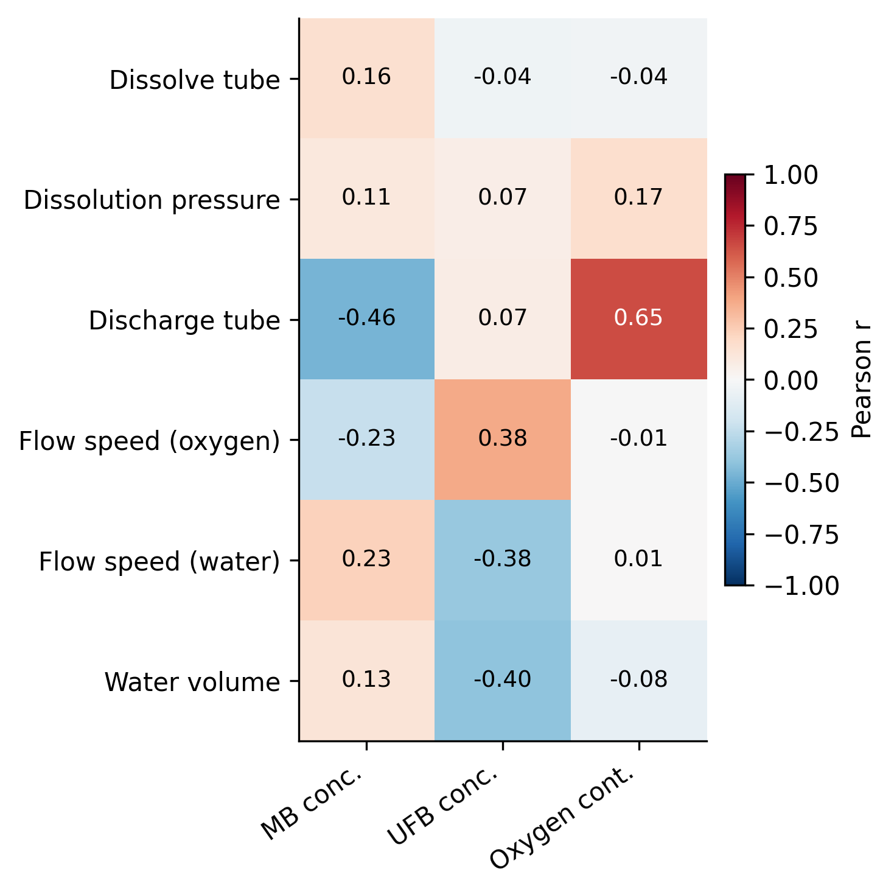

# Figure Set 軸表記の修正レポート

`.orders/order_005.md` に基づき，`ex002_figure_set` が生成する相関係数の図（Fig. 1）と Feature Importance の図（Fig. 2a–c）の軸表記を修正した．実験条件・データ・モデル自体の変更は無く，`.reports/report_003.md` に記載の実験結果（表・数値）はすべて有効である．

---

## 1. 指示内容

1. 相関係数の図（`correlation_input_target.png`）
   - 横軸（目的変数）の項目を `MB conc.` / `UFB conc.` / `Oxygen cont.` に変更する．
   - 縦軸（説明変数）・横軸ともに項目名から単位を取り除く．
2. Feature Importance の図（`feature_importance_*.png`）
   - 縦軸の軸ラベル（`Input variable`）を取り除く．
   - 横軸を 0〜100 に変更し，軸ラベルを `Feature Importance [%]` に変更する．

---

## 2. 変更内容

### 2.1 `ex002_figure_set/figures.py`

`plot_feature_importance` を以下のように変更した．

- 重要度の値を 100 倍してから描画し，横軸の既定範囲を `0.0〜100.0` とした（`xlim_max` の既定値も `1.0` → `100.0`）．
- 横軸ラベルを `Feature importance` → `Feature Importance [%]` に変更した．
- 縦軸ラベル（`ax.set_ylabel("Input variable")`）の設定を削除した．

`plot_correlation_heatmap` 自体は変更していない．渡された `DataFrame` の `index`／`columns` をそのままラベルとして描画する仕様のため，表示用ラベルの変換は呼び出し側（`run_figures.py`）で行う方針とした．

### 2.2 `ex002_figure_set/run_figures.py`

- `CORRELATION_TARGET_SHORT_LABELS`（目的変数の短縮名マッピング）と `_strip_unit`（末尾の `[...]` 単位表記を除去するヘルパー）を追加した．
- `_build_correlation_display_df` を追加し，`corr_df` の `index`（説明変数）から単位を除去，`columns`（目的変数）を短縮名に変換した表示専用の `DataFrame` を作成するようにした．
- 図の生成 (`plot_correlation_heatmap`) には上記の表示専用 `DataFrame` を渡し，CSV／Markdown 表（`tables/input_target_correlation.*`）には従来通り単位付きの `corr_df` を保存するようにした．**表の数値・ラベルは変更していない．**
- `plot_feature_importance` 呼び出し時の `xlim_max` を `1.0` → `100.0` に変更した．

### 2.3 `document.md`

- 「7. 表記規則」に例外節（7.1）を追加し，相関ヒートマップと F.I. 図の軸表記ルールおよび実装箇所を明記した．
- 実行方法の記載中，実体と異なっていた `.env_mb/bin/activate` を `.venv_mb/bin/activate` に修正した．

---

## 3. 実行確認

`uv` で `.venv_mb`（Python 3.11，`requirements_mb.txt` 準拠）を作成し，`ex002_figure_set/run_figures.py` を実行して全 Figure/Table を再生成した．エラーなく終了し，`outputs/ex002_figure_set/figures/` に画像が出力されることを確認した．

---

## 4. 結果

### Fig. 1: 相関係数ヒートマップ（修正後）

横軸が `MB conc.` / `UFB conc.` / `Oxygen cont.` の短縮表記になり，縦軸（`Dissolve tube` 等）・横軸ともに単位表記が無くなったことを確認した．相関係数の値自体（例: Discharge tube と Oxygen cont. の $r=0.65$）は `report_003.md` から変化していない．

### Fig. 2: Feature Importance（修正後，MB conc. の例）

横軸が 0〜100 の範囲になり，軸ラベルが `Feature Importance [%]` に変更されたこと，縦軸に軸ラベルが表示されないことを確認した．UFB conc.，Oxygen cont. の図についても同様の修正を確認した（`outputs/ex002_figure_set/figures/feature_importance_ufb_concentration_x10^7_particles_ml.png`，`feature_importance_oxygen_content_mg_l.png`）．重要度の大小関係・順位は変更前（`report_003.md` Table参照）から変化していない（値を 100 倍しただけ）．

---

## 5. 今後の検討候補

- 本修正はプレゼンテーション上の軸表記のみを対象としており，`tables/` 配下の数値表記（単位付き）は意図的に維持している．論文中の表記と図の表記に齟齬が生じないよう，本文執筆時に確認が必要である．
- Box-Plot（Fig. 3）および CV・モデル比較の表（Table 1, 2）は今回のオーダーの対象外であり，`report_003.md` の内容から変更していない．軸表記の統一方針を Box-Plot にも適用するかどうかは，次のオーダーで指示されない限り現状維持とする．
