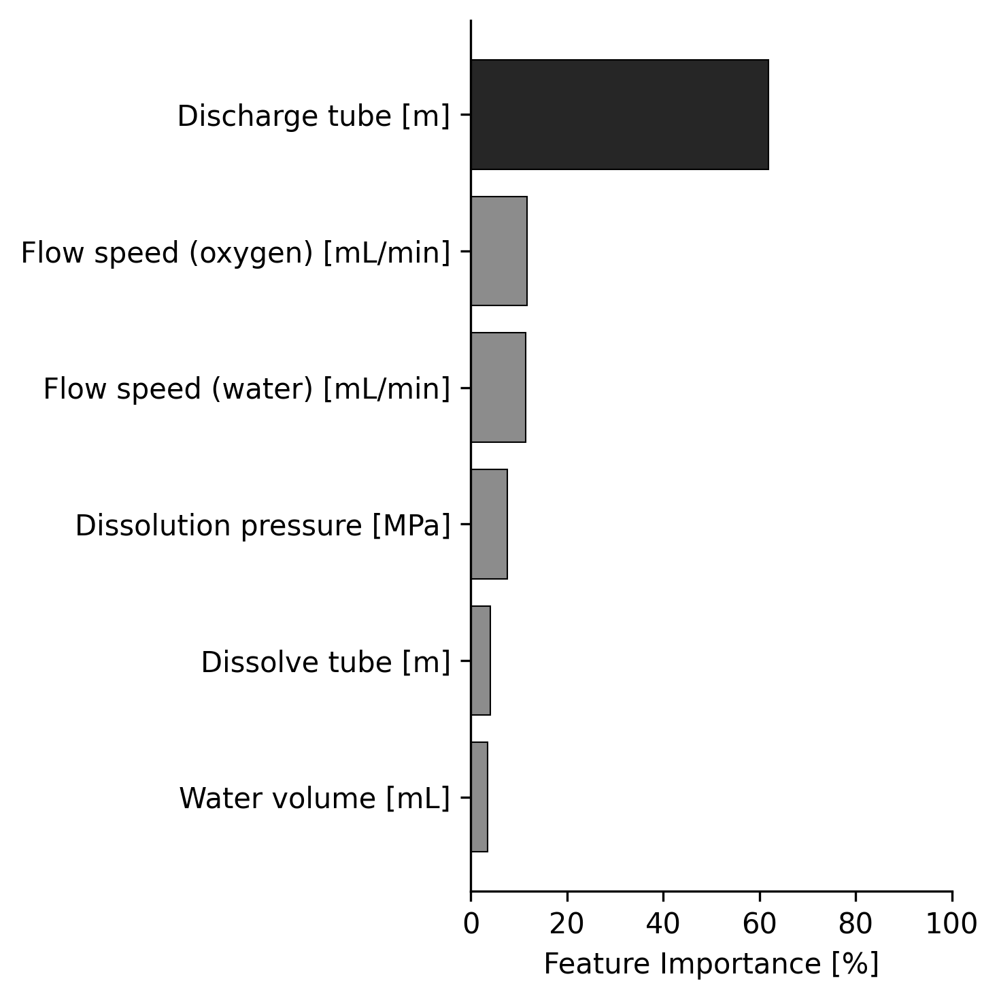
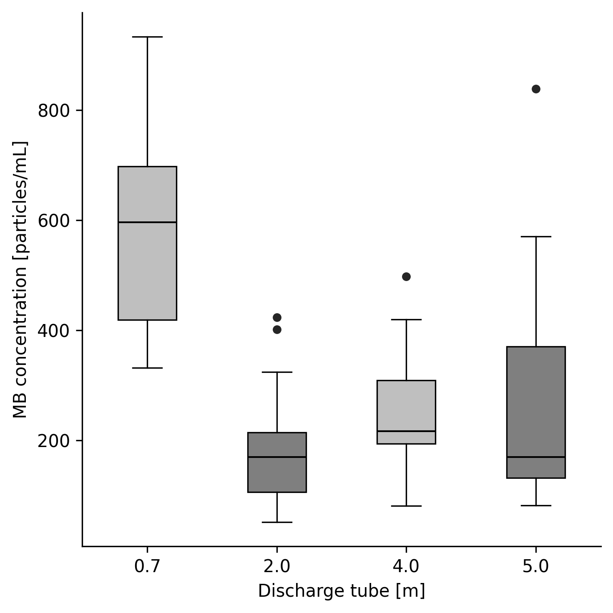

# Figure Set 配色の修正レポート（モノクロ化）

`.orders/order_006.md` に基づき，`ex002_figure_set` が生成する図のうち，相関係数ヒートマップ（`correlation_input_target.png`）以外の図（Feature Importance 棒グラフ，Box-Plot）をモノクロ配色に変更した．データ・モデル・数値自体の変更は無く，`.reports/report_003.md`，`.reports/report_005.md` に記載の実験結果（表・数値）はすべて有効である．

---

## 1. 指示内容

相関係数の図以外の図をモノクロにする．

---

## 2. 変更内容

### 2.1 `ex002_figure_set/figures.py`

- 配色定数を青・赤（`COLOR_BLUE = "#2166AC"`, `COLOR_RED = "#B2182B"`）から灰色階調に変更した．
  - `COLOR_DARK = "#262626"`（強調用の濃灰色，旧 `COLOR_RED` の代替）
  - `COLOR_LIGHT = "#8C8C8C"`（通常バー用の中間灰色，旧 `COLOR_BLUE` の代替）
  - `COLOR_CYCLE = ["#BFBFBF", "#7F7F7F"]`（Box-Plot 交互配色用の淡灰色・濃灰色，旧 `[COLOR_BLUE, COLOR_RED]` の代替）
- `plot_feature_importance`: 最重要特徴量のバー色を `COLOR_RED` → `COLOR_DARK`，それ以外のバー色を `COLOR_BLUE` → `COLOR_LIGHT` に変更した．
- `plot_boxplot_feature_target`: 外れ値マーカー色（`flierprops`）を `COLOR_RED` → `COLOR_DARK` に変更した．箱の交互配色は `COLOR_CYCLE` を参照する実装のままのため，値の変更のみで灰色階調になった．
- `apply_figure_style` の Docstring を「青・赤配色」から「モノクロ（相関ヒートマップを除く）」に修正した．
- `plot_correlation_heatmap` はカラーマップ（`RdBu_r`）を直接指定しており上記の配色定数を参照していないため，変更していない．

---

## 3. 実行確認

`.venv_mb` 上で `ex002_figure_set/run_figures.py` を再実行し，全 Figure/Table を再生成した．エラーなく終了したことを確認した．

---

## 4. 結果

### Fig. 2: Feature Importance（モノクロ化後，MB conc. の例）

最重要特徴量（Discharge tube）が濃灰色，それ以外が中間灰色のバーで表示されることを確認した．UFB conc.，Oxygen cont. の図も同様にモノクロ化されている．

### Fig. 3: Box-Plot（モノクロ化後，MB conc. の例）

箱の塗り色が淡灰色・濃灰色の交互配色に変更され，外れ値マーカーも濃灰色になったことを確認した．

### Fig. 1: 相関係数ヒートマップ（変更なし）

`.orders/order_003.md`／`.orders/order_004.md` の指示通り，赤（$r=1.0$）〜白（$r=0$）〜青（$r=-1.0$）のカラーマップを維持している．変更していないことを確認した．

---

## 5. 今後の検討候補

- Feature Importance のバーは「最重要特徴量のみ濃灰色，他は中間灰色」という強調表現を維持した．完全に単色（全バー同色）にすべきか，現状の 2 階調による強調を維持すべきかは，論文執筆時にレイアウト・印刷条件（白黒印刷時の判読性等）と合わせて判断が必要である．
- Box-Plot の交互配色（2 階調グレー）についても同様に，条件区分ごとの視認性を優先するか，完全な単色にするかは今後の指示待ちとする．
