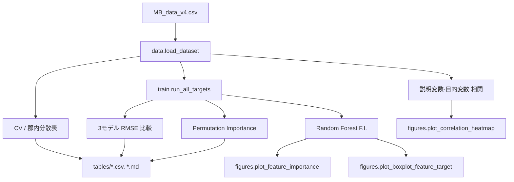

# ex002_figure_set — プログラム仕様書

本ドキュメントは `ex002_figure_set` における Figure Set 生成パイプラインの仕様を説明する．

---

## 1. 概要

`MB_data_v4.csv` を入力とし，論文執筆用の Figure Set（相関ヒートマップ，統計表，モデル比較表，F.I. 棒グラフ，散布図，置換重要度表）を生成する．

---

## 2. ディレクトリ構成

```text
ex002_figure_set/
├── data.py          # データ読み込み，CV/相関計算
├── figures.py       # モノクロ図の描画
├── train.py         # モデル学習・評価・Permutation Importance
├── run_figures.py   # 全 Figure/Table 生成のエントリポイント
└── train.ipynb      # Jupyter から run_figures.main() を実行

outputs/ex002_figure_set/
├── figures/         # PNG 図
├── tables/          # CSV / Markdown 表
└── manifest.json    # 生成メタデータ
```

---

## 3. 処理フロー



---

## 4. モジュール仕様

### 4.1 `data.py`

| 関数 | 概要 | 戻り値 |
| :--- | :--- | :--- |
| `load_dataset` | CSV 読み込み | `inputs (n,6)`, `targets (n,6)` |
| `build_groups` | 同一条件グループ ID | `groups (n,)` |
| `compute_cv_and_within_group_std` | CV（$\sigma/\mu$）と郡内標準偏差（標準化後） | `DataFrame` |
| `compute_input_target_correlation` | 説明変数×目的変数の Pearson $r$ | `DataFrame (6×3)` |
| `get_selected_targets` | MB, UFB, Oxygen を抽出 | `targets (n,3)` |

### 4.2 `figures.py`

| 関数 | 概要 |
| :--- | :--- |
| `apply_figure_style` | モノクロ，タイトルなし，最小スパイン |
| `plot_correlation_heatmap` | 相関係数ヒートマップ（カラー: 赤 1.0, 白 0, 青 -1.0） |
| `plot_feature_importance` | F.I. 水平棒グラフ（横軸上限指定可） |
| `plot_boxplot_feature_target` | 特徴量水準別 Box-Plot |
| `save_table_markdown` | Markdown 表保存 |

### 4.3 `train.py`

| 関数 | 概要 |
| :--- | :--- |
| `evaluate_models` | 線形/多項式/RF の GroupKFold RMSE |
| `compute_feature_importance` | RF F.I. fold 平均 |
| `compute_permutation_importance` | 置換重要度 fold 平均 |
| `run_all_targets` | 3 目的変数の一括実行 |

---

## 5. 実行方法

```bash
source .env_mb/bin/activate
cd ex002_figure_set
python run_figures.py
```

または `train.ipynb` を実行する．

---

## 6. 出力ファイル

### figures/

| ファイル | 内容 |
| :--- | :--- |
| `correlation_input_target.png` | 説明変数×目的変数 相関 |
| `feature_importance_mb_concentration_particles_ml.png` | MB F.I. |
| `feature_importance_ufb_concentration_x10^7_particles_ml.png` | UFB F.I. |
| `feature_importance_oxygen_content_mg_l.png` | Oxygen F.I. |
| `boxplot_*.png` | 最重要特徴量の Box-Plot |

### tables/

| ファイル | 内容 |
| :--- | :--- |
| `cv_within_group.md` | CV・郡内標準偏差 |
| `model_comparison.md` | 3 モデル RMSE |
| `permutation_importance_all.md` | 全目的変数の置換重要度 |
| `input_target_correlation.md` | 相関係数 |

---

## 7. 表記規則

- データセット中の NB 表記は UFB に統一
- 図の軸ラベルは英語，単位付き
- 評価 RMSE は標準化後スケール
